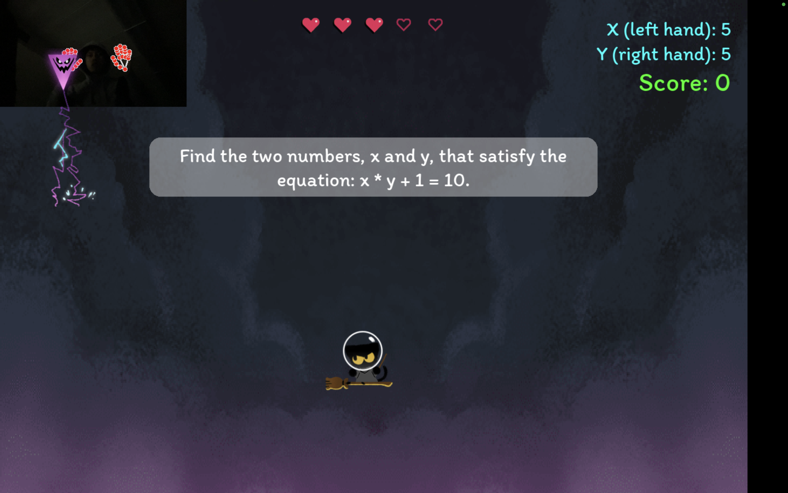
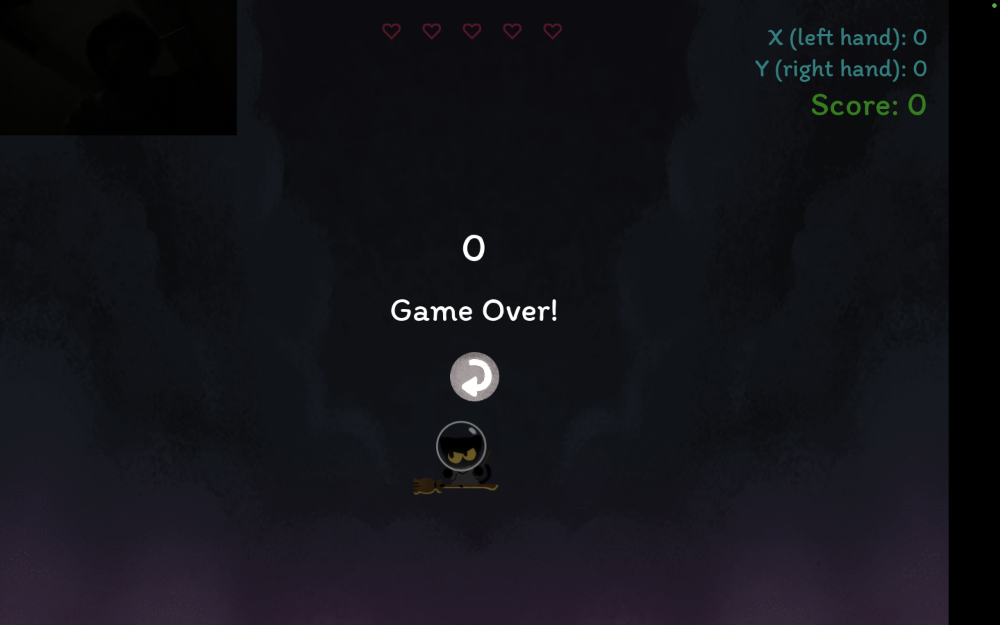

# Cat-Culus

🔗 [Video link](https://www.youtube.com/watch?v=ToHxbKb4sEQ)

🔗 [Github](https://github.com/mravaloarison/cat-culus)





## Project Description

A simple `Pygame` that leverages `Machine Learning` and `Artificial Intelligence` to save a cat by solving math problems. The design and game logic were primarily inspired by reverse engineering the [Google Cat Academy Third edition](https://doodles.google/doodle/halloween-2024/).

## How it Works

### Game Logic

-   The game generates math quizzes using the `Gemini API`.

```python
# Sample API response
res = [
    {
        "instructions": "Find the two numbers, x and y, that satisfy the equation: x + y = 2.",
        "combinations": [[1, 1], [2, 0]],
    },
    ...
]
```

-   We used [MediaPipe](https://mediapipe-studio.webapps.google.com/home) to detect the user's hand and fingers. The `x value` is represented by the `left hand` and the `y value` by the `right hand`.

-   The user solves the math problem by showing the number of fingers needed to satisfy the equation.

### Game Design

-   The UI is designed after the `Google Cat Academy Third edition.`
-   We used `Google Font Itim` for all the text in the game.
-   `Figma` to alligning all the assets.

## Team

-   [Jasmina](https://www.linkedin.com/in/jasmina-abdullaeva-142a55207/)
-   [Gabby](https://www.linkedin.com/in/gabriela-angarita-6b85a1299/)
-   [Rava](https://www.linkedin.com/in/mravaloarison/)
